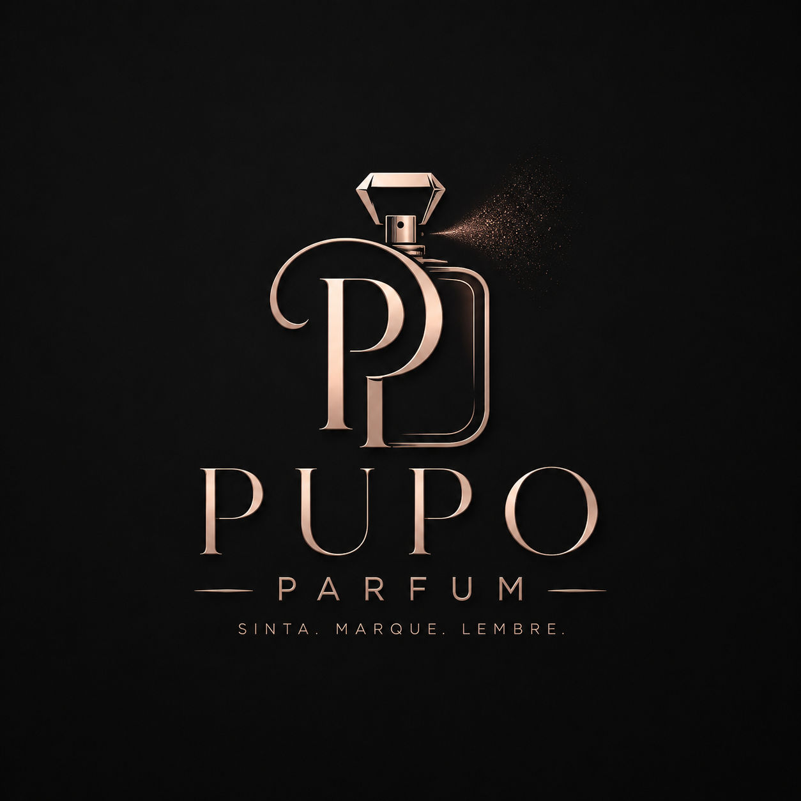
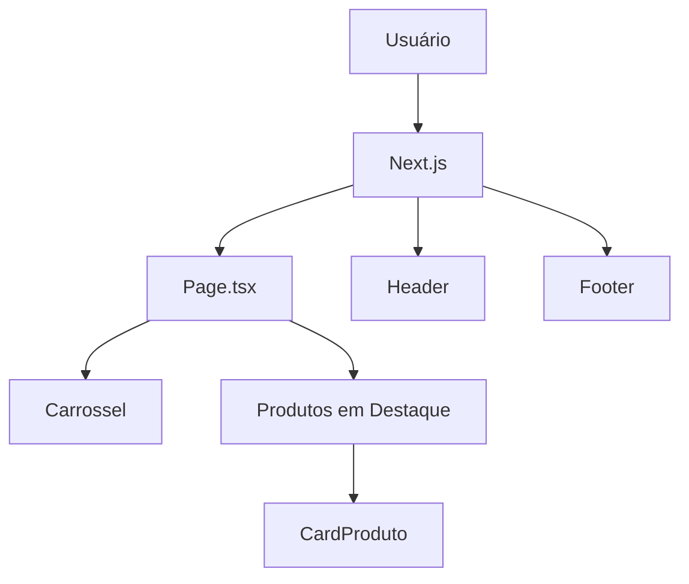

<div align="center">

# ✨ Pupo Parfums

### Elegância, sofisticação e exclusividade em cada fragrância



<br>


</div>

---

## 📖 Sobre o Projeto

A **Pupo Parfums** é uma plataforma de e-commerce desenvolvida para apresentar perfumes premium de maneira moderna, elegante e intuitiva.

O projeto foi construído com foco em:

✨ Experiência visual refinada  
⚡ Alta performance  
📱 Responsividade completa  
🧩 Componentização escalável  
🎨 Design sofisticado inspirado em marcas de luxo

---

## 🎯 Objetivos

- Exibir produtos de forma elegante
- Valorizar coleções exclusivas
- Criar uma identidade visual premium
- Proporcionar uma navegação intuitiva
- Servir como base para futuras integrações comerciais

---

## 🚀 Demonstração

### Página Inicial

- Banner promocional
- Carrossel interativo
- Produtos em destaque
- Navegação responsiva
- Rodapé institucional

> Adicione screenshots nesta seção para valorizar ainda mais o projeto.

---

## ✨ Funcionalidades

### 🖼️ Carrossel Promocional

- Reprodução automática
- Navegação manual
- Responsivo
- Otimizado com Embla Carousel

### 🛍️ Produtos em Destaque

- Listagem dinâmica
- Cards modernos
- Animações de hover
- Formatação automática de preços

### 📱 Layout Responsivo

- Desktop
- Tablet
- Smartphone

### 🎨 Interface Premium

- Paleta escura sofisticada
- Destaques dourados
- Tipografia moderna
- Microinterações suaves

---

## 🏗️ Estrutura do Projeto

```bash
src/
│
├── app/
│   ├── layout.tsx
│   ├── page.tsx
│   ├── contato/
│   │   ├── page.tsx
│   │   └── pageC.tsx
│   └── produtos/
│       ├── page.tsx
│       └── pageP.tsx
│
├── components/
│   ├── Header.tsx
│   ├── Footer.tsx
│   ├── Carrossel.tsx
│   ├── CardProduto.tsx
│   └── ui/
│       ├── badge.tsx
│       ├── button.tsx
│       ├── card.tsx
│       └── carousel.tsx
│
├── lib/
│   └── utils.ts
│
└── public/
    ├── logo/
    ├── carrossel/
    └── produtos/
```

---

## 🛠️ Tecnologias Utilizadas

| Tecnologia | Descrição |
|------------|------------|
| Next.js | Framework React |
| TypeScript | Tipagem estática |
| Tailwind CSS | Estilização |
| React | Interface de usuário |
| Embla Carousel | Sistema de carrossel |
| Lucide React | Ícones |
| Shadcn/UI | Componentes reutilizáveis |

---

## ⚙️ Instalação

Clone o repositório:

```bash
git clone https://github.com/DanielPupo/pupo-parfum.git
```

Entre na pasta:

```bash
cd pupo-parfums
```

Instale as dependências:

```bash
npm install
```

Execute o projeto:

```bash
npm run dev
```

Acesse:

```text
http://localhost:3000
```

---

## 📊 Arquitetura da Aplicação



---

## 📈 Diferenciais

✅ Interface moderna

✅ Componentização reutilizável

✅ Design responsivo

✅ Estrutura escalável

✅ Fácil manutenção

✅ Performance otimizada

✅ SEO Friendly

---

## 🔮 Roadmap

### Próximas funcionalidades

- [ ] Página individual do produto
- [ ] Carrinho de compras
- [ ] Checkout
- [ ] Lista de favoritos
- [ ] Sistema de avaliações
- [ ] Integração com Stripe
- [ ] Integração com WhatsApp
- [ ] Painel administrativo
- [ ] Área do cliente

---

## 🤝 Contribuição

Contribuições são bem-vindas.

```text
Fork
 ↓
Create Branch
 ↓
Commit
 ↓
Push
 ↓
Pull Request
```

---

## 👨‍💻 Autor

### Daniel Pupo

Desenvolvedor Front-End e Back-End focado em criar experiências digitais modernas e intuitivas.

Vercel do projeto:

```text
https://pupo-parfum.vercel.app
```
Vercel:

```text
https://vercel.com/daniel-pupos-projects
```

GitHub:

```text
https://github.com/DanielPupo
```

LinkedIn:

```text
https://www.linkedin.com/in/daniel-pupo-68a978356/
```

---

## 📜 Licença

Este projeto está sob a licença MIT.

---

<div align="center">

### 🌟 Pupo Parfums

Transformando fragrâncias em experiências digitais.

</div>